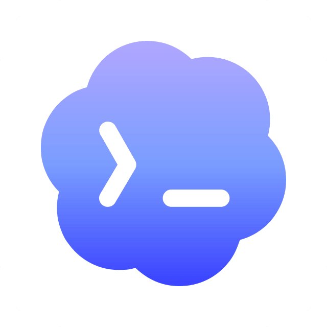

# agent-runtimes


<p align="center">
  <a href="./README.zh-CN.md">简体中文</a>
</p>

<p align="center">
  <a href="https://github.com/StratoSpheres-Labs/agent-runtimes/actions/workflows/ci.yml"></a>
  <a href="https://github.com/StratoSpheres-Labs/agent-runtimes/releases"></a>
  <a href="https://nodejs.org"></a>
  <a href="./LICENSE"></a>
</p>

`agent-runtimes` is a Node.js/TypeScript compatibility layer that unifies discovery, launch, control, and observation of local Agent CLIs through a single `Runtime → Session → Run → RuntimeEvent` API.

> [!WARNING]  
> agent-runtimes is currently an early technical preview — Windows and Linux is recommended for the best experience. macOS support is still being optimized, and stability there may lag behind Windows and Linux until then.

Developer docs : [Docs](./docs/dev/READDEVDOC.md)

## Supported runtimes

| ID                                                                                                                 | Session resume                | Live models     | Auth probe                | MCP discovery     |
| ------------------------------------------------------------------------------------------------------------------ | ----------------------------- | --------------- | ------------------------- | ----------------- |
|  `opencode`             | `-s` (capture-style)          | `models`        | `auth list` + `auth.json` | `mcp list`        |
|  `opencode-acp` | `session/load`                | —               | —                         | via `session/new` |
|  `claude`    | `--resume` (capture-style)    | static aliases¹ | `login status`            | `mcp list`        |
|  `codex`                | `exec resume` (capture-style) | `debug models`  | `login status`            | `mcp list`        |

¹ Claude Code has no list-models subcommand, so `sonnet` / `opus` / `haiku` (+ full `claude-*-5-*` names) are curated statically.

All four also expose read-only discovery — `models()`, `auth()`, `mcp()`, `skills()`, `plugins()` — metadata only, never file contents. Missing data degrades to `"unknown"` / `[]`, never a stale static list.

## Installation

Requires `Node.js >= 20`.

```bash
npm i @stratosphereslab/agent-runtimes
```

```bash
pnpm add @stratosphereslab/agent-runtimes
```

or from source:

```bash
git clone <this-repo> && cd agent-runtimes
pnpm install && pnpm build
```

## Usage

```ts
import { runtimes } from "@stratosphereslab/agent-runtimes";

const runtime = await runtimes.resolve("opencode"); // or "claude" / "codex"
const status = await runtime.detect(); // { installed, executable, version }
if (!status.installed) throw new Error("agent CLI not found");

const session = await runtime.createSession({ cwd: "./my-project" });
const run = await session.run("Analyze this project and describe its structure");

for await (const event of run.events()) {
  if (event.type === "text_delta") process.stdout.write(event.text);
  else if (event.type === "tool_started") console.log(`[tool] ${event.name}`);
  else if (event.type === "done") break;
}
await session.close();
```

Sessions span processes (`Session !== Process`): each `run()` spawns a fresh process, resume continues the agent-native session. Cancel with `run.cancel()` / `session.cancel()` — cleanup is total (stdio, child, listeners, timers).

Session rules worth knowing:

- **One active run per session** — a second `run()` while one is in flight rejects with `RuntimeSessionError` (never silently cancelled). Drain the first run's `done` event (or await its `result()` / `cancel()` it), then call again.
- **Cancel ends with `done`** — `run.cancel()` pushes a terminal `done` carrying the kill signal before closing the stream, so "cancelled" is distinguishable from "stream cut". `close()` alone is silent teardown.
- **Every event carries `runId`** (`<sessionId>:run<N>`, optional on the wire) for grouping interleaved streams; the agent's thinking surfaces as `reasoning_delta`, never mixed into `text_delta`.

## Input control

```ts
const runtime = await runtimes.resolve("claude");
const session = await runtime.createSession({
  cwd: "./my-project",
  model: "sonnet",
  reasoning: { effort: "high" },
  agent: "build", // opencode/claude only — see capabilities()
  workspace: { allowedPaths: ["./shared"], permissionMode: "plan" },
  allowedTools: ["Read"], // claude --allowedTools
  onPermissionRequest: async (req) => ({ optionId: "allow" }),
});

// Plain text or structured parts (text/image interleaving):
const run = await session.run(
  [
    { type: "text", text: "What is this?" },
    { type: "image", path: "./shot.png" },
  ],
  { model: "haiku" }, // per-run override
);
for await (const event of run.events()) {
  if (event.type === "permission_request") console.log("agent asks:", event.prompt);
  else if (event.type === "permission_denied") console.log("blocked:", event.reason);
  else if (event.type === "done") break;
}
// Mid-turn steering (ACP runtimes): await run.send("actually use pnpm");
await session.close();
```

Rules: every runtime declares what it supports via `runtime.capabilities()` (`agentSelection`, `toolAllowlist`, `systemPrompt`, …) — unsupported inputs are rejected loudly at `createSession`, never silently ignored. Resuming history without a native id isn't possible; fold prior turns with `foldSeedMessages()` and prepend them instead. Frontend wire contract (`WireSendInput`, NDJSON framing): `docs/frontend.md`.

## CLI

Check a runtime's health — exit `0` when it can run, `1` on blocking
failures, `2` on usage error:

```bash
# Installed bin (npm i -g @stratosphereslab/agent-runtimes)
agent-runtimes -d opencode
agent-runtimes -d claude
agent-runtimes -d codex

# No id: check every registered runtime in one go
agent-runtimes -d

# Machine-readable reports for setup wizards, plus the bin version
agent-runtimes -d --json
agent-runtimes --version

# A newer release known? A one-line nudge on stderr (never auto-installs,
# --json stays clean, exit codes unchanged)

# Local build — same path, long form (always works from source)
node dist/cli.js doctor opencode
```

Sample output:

```
Executable   ✓  C:\...\npm\node_modules\opencode-ai\bin\opencode.exe
Version      ✓  1.18.32
Model        ✓  182 model(s) across 3 providers: deepseek, nvidia, opencode
MCP          ✓  2 server(s): github, firecrawl
```

`agent-runtimes -h` prints usage; `doctor <id>` stays valid in both forms.

## Features

- **Discovery** — PATH + aliases + `*_BIN` overrides + known install locations; newest invocable version wins; broken shims skipped. `findAllInstalls()` lists every copy (package manager, version, selected); per-platform recognition keeps foreign shims out.
- **Sessions** — create / run / resume / cancel / close; native ids captured from the stream and persisted (`~/.agent-runtimes/sessions`, relocatable for Electron via `setSessionStoreDir`).
- **History** — read-only conversation history (`session.history()`) folded from each CLI's native transcript store; compact entries, `limit`/`since` paging, fail-open, never persisted by the library.
- **Events** — agent-agnostic `RuntimeEvent` only, JSON-serializable: `session_started | text_delta | reasoning_delta | tool_started | tool_finished | usage | permission_request | permission_denied | error | done`. Never leaks stdout/stderr/JSONL. Every event carries an optional `runId`; thinking is display-only (`reasoning_delta`) and empty thinking is dropped, never errored.
- **Models / Auth / MCP** — per-runtime live discovery (`models()`, `auth()`, `mcp()`); unknown degrades to `"unknown"`, never a stale static list. Explicit models are validated at session creation (`isKnownModel` — typos rejected before anything spawns); opencode `--variant` only sends advertised variants.
- **Skills / Plugins** — read-only metadata discovery (`skills()`, `plugins()`): global + project roots, marketplace ids, versions, enabled state. Never file contents.
- **Versions & diagnostics** — per-adapter CLI version policy (`untested-version` warnings); `doctor` rows carry machine-readable `reason` codes (`not-on-path`, `shim-broken`, `auth-missing`, …) rendered inline. The Version row appends `→ latest` when the npm registry has a newer release (`update-available`).
- **Capabilities, not names** — branch on `runtime.capabilities().sessionResume`, never `runtime.id === "claude"`.
- **Guardrails** — images (path-primary), workspace allowlist / sandbox / permission-mode gating, prompt-size budget, interactive permission requests (`AskUserQuestion` / ACP), secret-free logs and error details.

## Development

```bash
pnpm build      # tsup → dist/
pnpm lint       # eslint (flat + typescript-eslint strict)
pnpm typecheck  # tsc --noEmit
pnpm test       # vitest run
```

Order matters: `build → lint → typecheck → test` (all four must pass before merge).

- `docs/development.md` / `docs/development.zh-CN.md` — setup, test tiers, adding a runtime, troubleshooting.
- `docs/architecture.md` — the `Runtime ≠ Session ≠ Run ≠ Transport ≠ Parser` model and the seven hard rules.
- `docs/frontend.md` — wire contract for UI consumers: NDJSON framing, `runId` attribution, `reasoning_delta`, cancel semantics.
- `docs/runtime-authoring.md` — how to add `runtimes/<id>/` as an architecture pressure test.
- `AGENTS.md` — repo conventions, layout, testing expectations.

## Project Structure

```
src/core/         # runtime, session, run, registry, lifecycle, session-store — agent-agnostic
src/definition/   # identity, executable, input, transport, session, capability, model, mcp, auth, …
src/events/       # RuntimeEvent, EventStream
src/transport/    # RuntimeTransport + StdioTransport + AcpTransport
src/parser/       # RuntimeParser + JSONL impl (partial-chunk safe)
src/discovery/    # executable / version / models / mcp / auth probing
src/doctor.ts     # doctor report + summarizeModels
src/cli.ts        # agent-runtimes [-d|--doctor] <id> (doctor <id> also valid)
runtimes/opencode/ | claude/ | codex/ | opencode-acp/  # definition, parser, runtime, session, fixtures
tests/  examples/basic.ts  docs/
```

## License

Apache-2.0 — see [LICENSE](./LICENSE).
