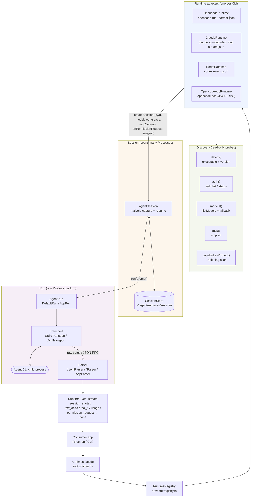

# Development Guide

This is the contributor entry point. It covers how to set up, build, test, debug, add a runtime, and ship a release. For the bigger picture, see:

- `architecture.md` — why `Runtime≠Session≠Run≠Transport≠Parser`, the `Agent CLI → Transport → Parser → RuntimeEvent` pipeline, and the seven hard rules
- `runtime-authoring.md` — the 5-file layout and checklist for a new adapter
- `cross-platform.md` — Windows/POSIX differences for `PATH`, `spawn`, `stdin`, `signals`, `env`, `file paths`

---

## Table of Contents

1. [Prereqs](#prereqs)
2. [Setup](#setup)
3. [Project Layout](#project-layout)
4. [Architecture Overview](#architecture-overview)
5. [The Four Gates](#the-four-gates)
6. [Test Tiers](#test-tiers)
7. [Running & Debugging Tests](#running--debugging-tests)
8. [Adding a Runtime](#adding-a-runtime)
9. [Workspace / Permissions / Images / Usage](#workspace--permissions--images--usage)
10. [Session Persistence](#session-persistence)
11. [Local Link vs Publish](#local-link-vs-publish)
12. [CI](#ci)
13. [Release](#release)
14. [Code Style & Conventions](#code-style--conventions)
15. [Troubleshooting](#troubleshooting)

---

## Prereqs

- **Node.js >= 20** (`node --version`). `v24` is the primary local version; CI runs `22` and `24`.
- **pnpm >= 10** (`corepack enable && corepack prepare pnpm@10 --activate`). The repo is `type: module` and uses `pnpm-workspace.yaml`.
- **Agent CLIs** (optional, but needed for integration/live tests):
  ```bash
  opencode --version   # 1.18.27 verified locally at .../opencode-ai/bin/opencode.exe
  claude --version     # 2.1.187 via WinGet (...\Anthropic.ClaudeCode_...\claude.exe)
  codex --version      # 0.150.1 via npm (codex.cmd shim → node vendor)
  # If a CLI is absent, its integration test is skipped — `pnpm test` still passes.
  # To install opencode for CI parity: npm install -g opencode-ai@latest
  ```
- **Windows is the primary dev machine**; `macos-latest` and `ubuntu-latest` are covered only via CI (see `CI` below). Always use `os.tmpdir()` + `fs.mkdtemp` for scratch dirs, never `C:\Temp`.

---

## Setup

```bash
git clone https://github.com/StratoSpheres-Labs/agent-runtimes.git
cd agent-runtimes
pnpm install
pnpm build   # tsup ESM node20 → dist/index.js + dist/index.d.ts + dist/cli.js
```

- `dist/` is `gitignored` (`files: ["dist"]` in `package.json` ensures it is still published). Never edit `dist/` by hand.
- `pnpm build` uses `tsup.config.ts` with two entries (`index` and `cli`), `splitting:false`, `treeshake:true`, `sourcemap:true`, `dts.resolve:true` (self-contained `dist/index.d.ts`).

---

## Project Layout

```
src/core/         # runtime, session, run, registry, lifecycle — agent-agnostic (Rule 1)
src/definition/   # identity, executable, input, transport, session, capability, workspace, permission, image, prompt, reasoning, model
src/events/       # RuntimeEvent (session_started|text_delta|tool_started|tool_finished|error|done|usage|permission_request) + EventStream
src/transport/    # transport interface + StdioTransport + AcpTransport (JSON-RPC over stdio)
src/parser/       # parser interface + JsonlParser + AcpParser
src/discovery/    # executable (where/which), version, capabilities (help probing), models, npm-shim, run-command, env
runtimes/opencode/  # definition.ts, parser.ts, runtime.ts, session.ts, fixtures/*.jsonl, index.ts
runtimes/claude/    # same 5 files
runtimes/codex/     # same 5 files
runtimes/opencode-acp/ # acp variant (transport: acp)
tests/            # unit + fixture + integration
tests/integration/ # real-CLI tests (skip if binary absent)
examples/basic.ts # minimal rts → session → run → events loop
docs/             # architecture.md, runtime-authoring.md, cross-platform.md, development.md
```

Single package for `v0.1` (`Dev_Docs:448`). No `@agent-runtimes/*` split yet.

## Architecture Overview



Key invariants (see `architecture.md`): `Session ≠ Process` (each `run()` spawns a fresh child; resume replays the native id), Transport never parses, Parser never manages lifecycle, and only agent-agnostic `RuntimeEvent` crosses the boundary back to the app.

---

## The Four Gates

**Order matters** `build → lint → typecheck → test` — it catches generated-code/type errors before the slow `test` leg.

```bash
pnpm build      # tsup → dist/ — fails if tsup config or tsconfig is broken
pnpm lint       # eslint flat + typescript-eslint strict + prettier — fails on `no-empty`, `no-unused-expressions`, `restrict-template-expressions` etc.
pnpm typecheck  # tsc --noEmit — fails on `noUnnecessaryCondition`, missing `workspace` field, etc.
pnpm test       # vitest run — 196 tests, ~35s, 34 files
```

- **Fixing `build`**: check `tsup.config.ts` `entry` and `tsconfig.json` `moduleResolution: bundler`.
- **Fixing `lint`**: `pnpm lint:fix` does `eslint --fix`; for the `catch (_e) { String(_e) }` pattern we use `String(_e)` to satisfy both `no-empty` and `no-unused-expressions`.
- **Fixing `typecheck`**: ensure every `RuntimeDefinition.capabilities` has `workspace` (added in Phase 23) and every `RuntimeEvent` union member is handled.
- **Fixing `test`**: run the failing file in isolation `npx vitest run tests/<file>.test.ts --reporter=verbose` before the full `pnpm test`.

CI runs the same four on `windows/macos/ubuntu × node 22/24` (`strategy.fail-fast: false`, `timeout-minutes: 20`).

---

## Test Tiers

### 1. Unit / Fixture

- `tests/<id>.test.ts` — `buildArgs` cases, `discovery`, `lifecycle`, `capabilities`
- `runtimes/<id>/fixtures/*.jsonl → Parser → RuntimeEvent[]` — the core of the project. Every fixture must be fed in **two halves** (`mid = len/2`) to prove chunk-split buffering, plus `flush()`.

```ts
const raw = readFileSync(`runtimes/claude/fixtures/${name}`, "utf-8");
const p = new ClaudeParser();
const a = p.parse(enc(raw.slice(0, mid)));
const b = p.parse(enc(raw.slice(mid)));
expect([...a, ...b, ...p.flush()]).toContainEqual({ type: "text_delta" });
```

Cover `illegal.jsonl` (invalid JSON → `INVALID_JSON`), `unknown.jsonl` (`UNKNOWN_EVENT`), `empty.jsonl` (`0 events`), and a `user-tool-result.jsonl` / `permission-ask.jsonl` for the `AskUserQuestion → permission_request` path.

### 2. Integration

`tests/integration/opencode*.test.ts`:

```ts
const runtime = await runtimes.resolve("opencode-acp");
const session = await runtime.createSession({
  cwd: mkdtempSync(join(tmpdir(), "...")),
  model: "opencode/mimo-v2.5-free",
});
const run = await session.run("reply with exactly: OK", { timeout: 90000 });
for await (const e of run.events()) if (e.type === "text_delta") text += e.text;
// asserts: session_started + done + text.includes("OK")
```

- Skips gracefully if `findExecutable` returns `null`.
- The `ubuntu+node24` CI leg installs `opencode-ai@latest` and then re-runs `tests/integration/opencode*.test.ts` for real-CLI coverage.

### 3. Live Ad-hoc

```ts
import { runtimes } from "agent-runtimes";
const rt = await runtimes.resolve("claude");
const s = await rt.createSession({
  cwd,
  workspace: { allowedPaths: [cwd], permissionMode: "bypassPermissions" },
});
const run = await s.run("Describe this image", { images: [{ path: "./shot.png" }] });
for await (const e of run.events()) console.log(e);
```

Use `os.tmpdir()` scratch dirs and `tiny.png` (`1×1`) for image. See `examples/basic.ts` for the canonical loop and `tmp-feas-stability.mjs` (deleted after verification) for the `PING→PONG2→image` chain.

---

## Running & Debugging Tests

```bash
# Single file, verbose
npx vitest run tests/claude.test.ts --reporter=verbose

# Single test by name
npx vitest run -t "AskUserQuestion → permission_request"

# Watch mode
pnpm test:watch

# With real CLI (ensure binary on PATH)
pnpm test --run tests/integration/opencode-acp.test.ts

# Debug a hanging AcpTransport (increase timeout)
# src/transport/acp.ts: DEFAULT_REQUEST_TIMEOUT_MS = 60_000 (was 30s)
```

- **Hanging `session/new`**: increase `AcpTransport` timeout or `run.timeout` (integration tests use `90000`).
- **Windows file-lock on `rmSync`**: retry 5× with `500ms` delay (see `tests/integration/opencode-acp.test.ts:8` `rmRetry`).
- **Stale shim**: `resolveShimTarget` caches `NODE_PATH`; delete `dist/` and `pnpm build` to refresh.

---

## Adding a Runtime

Follow `runtime-authoring.md` §2. Copy `runtimes/opencode/` as a template.

**1. Definition** (`runtimes/<id>/definition.ts`):

```ts
export const myDefinition: RuntimeDefinition = {
  identity: { id: "my-agent", name: "My Agent" },
  executable: { command: "my-agent", aliases: ["my-agent-bin"], versionArgs: ["--version"] },
  input: { type: "stdin" }, // or "argv" / "file" — stdin is cross-platform safe (32767 limit)
  transport: { type: "stdio" }, // or "acp"
  capabilities: {
    streaming: true,
    sessionResume: true,
    modelSelection: true,
    reasoning: true,
    images: true,
    workspace: true,
  },
  session: { persistent: true },
  models: { fallbackModels: [{ id: "my-model", provider: "my" }], listCommand: ["models"] },
};
export type MyBuildArgsOptions = {
  model?: string;
  sessionId?: string;
  dir?: string;
  images?: string[];
};
export function buildMyArgs(o: MyBuildArgsOptions) {
  const a = ["run", "--format", "json"];
  if (o.model) a.push("--model", o.model);
  if (o.dir) a.push("--dir", o.dir);
  return a;
}
```

**2. Parser** (`parser.ts`): `class MyParser implements RuntimeParser`. Reuse `JsonlParser` for JSONL, handle `partial chunks`, `coalesced lines`, `illegal JSON → INVALID_JSON`, `unknown → UNKNOWN_EVENT`, `empty → []`. For `claude`-style `AskUserQuestion`, map `tool_use{name:"AskUserQuestion"} → permission_request`.

**3. Runtime** (`runtime.ts`):

```ts
export class MyRuntime extends DefaultRuntime {
  constructor() {
    super(myDefinition);
  }
  buildArgs(o: MyBuildArgsOptions) {
    return buildMyArgs(o);
  }
  createParser() {
    return new MyParser();
  }
  override async createSession(opts?: CreateSessionOptions) {
    const { cwd, model, workspace, resumeSessionId } = opts ?? {};
    const exe = (await this.detect()).executable ?? myDefinition.executable.command;
    return new MySession({
      id: `my_${Date.now()}`,
      command: exe,
      cwd,
      model,
      workspace,
      resumeSessionId,
    });
  }
}
```

**4. Session** (`session.ts`): extend `AgentSession`, capture `nativeId` from `session_started`, replay via `buildMyArgs({sessionId: nativeId})`, handle `images` via `stageImageToTempFile` + `buildAgentEnv`, `permission_request` via `onPermissionRequest` + `keepStdinOpen`.

**5. Fixtures** (`fixtures/*.jsonl`): at least `text/tool/error/done/mixed/illegal/unknown/empty` + `real-my-agent.jsonl` captured via `my-agent run --format json`.

**6. Register**:

```ts
import { RuntimeRegistry } from "agent-runtimes";
import { myDefinition } from "./runtimes/my-agent/definition.js";
import { MyRuntime } from "./runtimes/my-agent/runtime.js";
const registry = new RuntimeRegistry();
registry.register(myDefinition, () => new MyRuntime());
// also add to src/runtimes.ts so runtimes.resolve("my-agent") works
```

**7. Tests & Docs**: `tests/my-agent.test.ts` (buildArgs + fixtures), `tests/integration/my-agent.test.ts` (real CLI), update `docs/architecture.md` if a new `capability` or `transport` is needed.

**Checklist** (must be green before PR):

- [ ] `src/core` has no `if (runtime.id==="xxx")` (Rule 1)
- [ ] No CLI flags leak to `CreateSessionOptions` (Rule 2)
- [ ] `Session !== Process` shown via `tests/session.test.ts`
- [ ] `RuntimeEvent` is `text_delta|tool_started|tool_finished|error|done|usage|permission_request` only
- [ ] `pnpm build && pnpm lint && pnpm typecheck && pnpm test` green on `windows` (local) and CI `6/6`

---

## Workspace / Permissions / Images / Usage

- **Workspace** (`src/definition/workspace.ts`): `workspace: { allowedPaths, permissionMode, dangerouslySkipPermissions, sandboxMode }`

  ```ts
  // Claude: --add-dir + --permission-mode + --dangerously-skip-permissions
  // Codex:  -C (new) / -c sandbox_mode="..." (resume) + --sandbox
  // Opencode: --dir (always, via resolve(cwd)) + images -f
  ```

  Paths are `resolve(cwd)` + `normalizeWorkspaceAllowedPaths` (dedupe, `isAbsolute`, `trim`). `opencode --dir` is mandatory (daemon's `appendOpenCodeWorkspaceDir`) to avoid writing to the repo root.

- **Permissions** (`src/definition/permission.ts` + `src/core/run.ts`):

  ```ts
  // Bypass (open-design replication, trusted workspace)
  createSession({ workspace: { permissionMode: "bypassPermissions" } });
  // or explicit dangerous alias
  createSession({ workspace: { dangerouslySkipPermissions: true } });
  // Interactive (AskUserQuestion → permission_request → UI)
  createSession({
    onPermissionRequest: async (req) => {
      const ans = await showDialog(req); // req.options: {optionId,kind,label}[]
      return { optionId: ans.optionId };
    },
  });
  ```

  ACP uses `AcpTransport.setAgentRequestHandler` (`session/request_permission` → `{optionId}` or `-32601`), Claude uses `ClaudeParser`'s `AskUserQuestion` mapping + `DefaultRun.keepStdinOpen` duplex. Without a handler the run never stalls (returns `-32601` or `tool_finished{error:true}`).

- **Images** (`src/definition/image.ts`):

  ```ts
  run("Describe this", { images: [{ path: "./shot.png" }] });
  run("Describe", { images: [{ data: Buffer.from(b64, "base64"), mimeType: "image/png" }] });
  ```

  `stageImageToTempFile` stages inline `data` to `tmpdir/agent-runtimes-img-*` and tracks via `stagedIsTemp` (prefix check) for `close()` cleanup. Mapping: `codex -i / opencode -f / claude base64 stdin / acp prompt[]`.

- **Usage** (`src/events/runtime-event.ts` + `src/parser/acp.ts` + `runtimes/*/parser.ts`): `usage` is emitted **before** `done` from `acp usage_update`, `claude result.total_cost_usd`, `codex turn.completed.usage`, and `AcpRun.result.usage`. Generic `{"type":"usage"}` is also mapped by `JsonlParser`.

---

## Session Persistence

```ts
import {
  saveSessionRecord,
  loadSessionRecord,
  listSessionRecords,
  deleteSessionRecord,
  setSessionStoreDir,
  getSessionStoreDir,
} from "agent-runtimes";
```

- Default store: `~/.agent-runtimes/sessions/<daemonId>.json` (`homedir()` fallback `os.tmpdir()`). Each `session_started` auto-saves `{id,nativeId,cwd,model,updatedAt}`.
- Hydration: `createSession({ resumeSessionId: nativeId })` replays via `--resume` / `-s` / `exec resume` / `session/load`.
- Electron override:
  ```ts
  import { setSessionStoreDir } from "agent-runtimes";
  setSessionStoreDir(join(app.getPath("userData"), "sessions"));
  ```
- Tests isolate with `setSessionStoreDir(mkdtempSync(join(tmpdir(),"test-store-")))` + `afterEach: setSessionStoreDir(null)`.

---

## Local Link vs Publish

- **Local app (Electron/CLI)** — no publish needed:

  ```bash
  pnpm add file:../agent-runtimes   # or pnpm link ../agent-runtimes
  pnpm build                        # must rebuild after src changes
  ```

  `package.json` is `type:module`, `sideEffects:false`, `exports: {".": {import:"./dist/index.js"}}`, `bin: {agent-runtimes:"./dist/cli.js"}`.

- **Share via npm**:

  ```bash
  pnpm build
  pnpm publish --access public   # requires npm login; package name agent-runtimes must be free
  ```

  `files: ["dist"]` ensures only `dist/` is published (source stays out). Add `prepublishOnly: "pnpm build"` if you want to guard against forgetting.

- **Verify the tarball**:
  ```bash
  pnpm pack --dry-run   # lists files that would be published
  ```

---

## CI

`.github/workflows/ci.yml` — `windows/macos/ubuntu × node 22/24`, `fail-fast:false`, `timeout-minutes:20`, `permissions: contents:read`.

```yaml
- uses: pnpm/action-setup@v4 # version 10
- uses: actions/setup-node@v4 # cache: pnpm
- run: pnpm install --frozen-lockfile
- run: pnpm build
- run: pnpm lint
- run: pnpm typecheck
- run: pnpm test
- if: matrix.os == 'ubuntu-latest' && matrix.node == 24
  run: npm install -g opencode-ai@latest && opencode --version && pnpm test --run tests/integration/opencode*.test.ts
```

- `Node 20` is deprecated on runners (forced to 24) — matrix uses `22,24`.
- Integration tests skip gracefully if the binary is absent; the `ubuntu+24` leg guarantees at least one real-CLI run.

---

## Release

- `main` is protected after `v0.1.0`. Use `feat/*` branches → PR, `Conventional Commits` (`feat:`, `fix:`, `ci:`, `docs:`).
- Before tagging: `pnpm build && pnpm lint && pnpm typecheck && pnpm test` green locally and on CI `6/6`.
- Tag & publish:
  ```bash
  npm version patch|minor|major -m "chore: release %s"
  git push --follow-tags
  npm publish --access public  # or via `pnpm publish`
  # GitHub Release is created from the tag; CI does not auto-publish (add a `publish.yml` if you want it)
  ```

---

## Code Style & Conventions

- **ESLint flat** + `typescript-eslint` **strict** + `prettier` strict — `pnpm lint` must be 0 errors, `lint:fix` is safe.
- Common fixes: `catch (_e: unknown) { String(_e); }` to satisfy `no-empty` + `no-unused-expressions` + `no-meaningless-void-operator`; `String(x)` for `restrict-template-expressions` on `number`.
- **Types**: `strictNullChecks`, no `any`, `no-unnecessary-condition` is strict — guard with `if (x !== undefined)` not `?.`.
- **Commits**: `Conventional Commits`, `feat:` for new runtime/capability, `fix:` for parser/transport, `ci:` for workflow, `docs:` for `docs/`.

---

## Troubleshooting

- **`where` vs `which -a`**: `findExecutable` uses `where` on Windows and `which -a` on POSIX; `.exe > .cmd > bare` preference matches `spawn` with `shell:false`. Npm `.cmd` shims are resolved to the underlying `.js` via `resolveShimTarget` — never spawn a `.cmd` directly.
- **`SIGTERM → 1s → SIGKILL`**: on Windows both are termination (no graceful delivery). `cancel()/close()` must clean `stdin/stdout/stderr/listeners/timers/buffers/promises` (see `architecture.md §Lifecycle`). Every timer is `unref()`'d.
- **Scratch dirs**: always `os.tmpdir()` + `fs.mkdtemp`, never `C:\Temp` or `~/tmp`. `rmSync` may `EPERM` on Windows if the agent still holds the `cwd` lock — retry 5× with `500ms` (see `tests/integration/opencode-acp.test.ts:8`).
- **`process.env`**: never forward blindly (leaks `API_KEY`/`TOKEN`). Only explicit merges: `codex` via `shim.env → {…process.env,…shim.env}` and `opencode` via `OPENCODE_CONFIG_CONTENT` (see `AGENTS.md §9`).
- **Prompt size**: `assertPromptWithinHardBudget` throws at `200k` bytes; `shouldUseFileForPrompt` hints at `30k` for `promptViaFile` (all current runtimes use `stdin`, so `CreateProcess 32767` is already avoided).
- **Stale session**: `resumeSessionId` that no longer exists rejects loudly (`RuntimeProtocolError` for ACP, `NON_ZERO_EXIT` for CLI) — never silently falls back to a fresh session.
