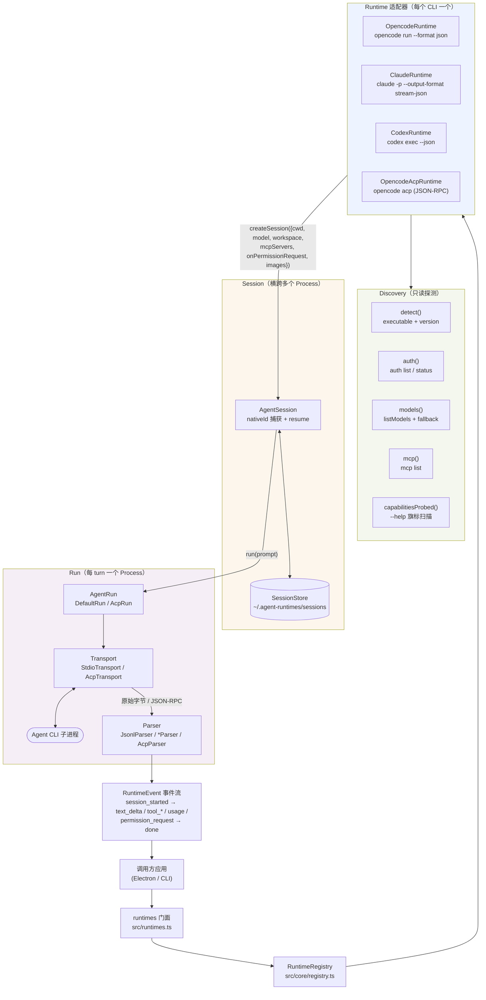

# 开发指南

贡献者入口，涵盖环境、构建、测试、新增 Runtime、联调与发版。架构、作者指南与跨平台细则见 `architecture.md`、`runtime-authoring.md`、`cross-platform.md`。

---

## 目录

1. [环境](#环境)
2. [初始化](#初始化)
3. [目录结构](#目录结构)
4. [架构总览](#架构总览)
5. [四道门禁](#四道门禁)
6. [测试分层](#测试分层)
7. [本地运行与调试](#本地运行与调试)
8. [新增 Runtime](#新增-runtime)
9. [工作区 / 权限 / 图片 / 用量](#工作区--权限--图片--用量)
10. [会话落盘](#会话落盘)
11. [本地联调 vs 发布](#本地联调-vs-发布)
12. [CI](#ci)
13. [发版](#发版)
14. [代码风格与约定](#代码风格与约定)
15. [排障](#排障)

---

## 环境

- **Node.js >= 20**（`node --version`），本地主用 `v24`，CI 跑 `22` 与 `24`
- **pnpm >= 10**（`corepack enable && corepack prepare pnpm@10 --activate`），仓库为 `type: module` 且含 `pnpm-workspace.yaml`
- **Agent CLI**（可选，无则集成测试跳过，`pnpm test` 仍绿）：
  ```bash
  opencode --version   # 本机已验 1.18.27 @ .../opencode-ai/bin/opencode.exe
  claude --version     # 2.1.187 WinGet
  codex --version      # 0.150.1 npm 的 codex.cmd → node vendor
  # 无 CLI 时集成测试优雅跳过；CI 的 ubuntu+node24 会 npm install -g opencode-ai 真跑
  ```
- 主开发机 `Windows`，`macos-latest`/`ubuntu-latest` 仅 CI 覆盖，临时目录一律 `os.tmpdir()` + `fs.mkdtemp`，勿写死 `C:\Temp`

---

## 初始化

```bash
git clone https://github.com/StratoSpheres-Labs/agent-runtimes.git
cd agent-runtimes
pnpm install
pnpm build   # tsup ESM node20 → dist/index.js + dist/index.d.ts + dist/cli.js
```

- `dist/` 已 `gitignore`（`package.json: files: ["dist"]` 保证发包时仍带），勿手改
- `pnpm build` 走 `tsup.config.ts` 双入口（`index`/`cli`），`splitting:false`、`treeshake:true`、`sourcemap:true`、`dts.resolve:true`（`dist/index.d.ts` 自包含）

---

## 目录结构

```
src/core/           # runtime、session、run、registry、lifecycle — 与 agent 无关（规则 1）
src/definition/     # identity、executable、input、transport、session、capability、workspace、permission、image、prompt、reasoning、model
src/events/         # RuntimeEvent（session_started|text_delta|tool_started|tool_finished|error|done|usage|permission_request）+ EventStream
src/transport/      # transport 接口 + StdioTransport + AcpTransport（JSON-RPC over stdio）
src/parser/         # parser 接口 + JsonlParser + AcpParser
src/discovery/      # executable（where/which）、version、capabilities（help 探测）、models、npm-shim、run-command、env
runtimes/opencode/  # definition.ts、parser.ts、runtime.ts、session.ts、fixtures/*.jsonl、index.ts
runtimes/claude/    # 同上 5 文件
runtimes/codex/     # 同上 5 文件
runtimes/opencode-acp/ # acp 变体（transport: acp）
tests/              # 单测 + 夹具 + 集成
tests/integration/  # 真机集成（无二进制时跳过）
examples/basic.ts   # 最小 rts → session → run → events 循环
docs/               # architecture.md、runtime-authoring.md、cross-platform.md、development.md
```

`v0.1` 单包（`Dev_Docs:448`），暂不拆 `@agent-runtimes/*`。

## 架构总览



核心不变量（见 `architecture.md`）：`Session ≠ Process`（每次 `run()` 起新子进程，resume 时重放 native id）、Transport 不解析、Parser 不管生命周期、回应用的只有与 agent 无关的 `RuntimeEvent`。

---

## 四道门禁

**顺序固定** `build → lint → typecheck → test`，可早暴露生成代码/类型错误：

```bash
pnpm build      # tsup → dist/ — tsup/tsconfig 坏则挂
pnpm lint       # eslint flat + typescript-eslint strict + prettier — `no-empty`/`no-unused-expressions`/`restrict-template-expressions` 等
pnpm typecheck  # tsc --noEmit — 缺 `workspace` 字段、`RuntimeEvent` 漏分支等
pnpm test       # vitest run — 196 用例，约 35s，34 文件
```

- 修 `build`：看 `tsup.config.ts` 的 `entry` 与 `tsconfig.json` 的 `moduleResolution: bundler`
- 修 `lint`：`pnpm lint:fix` 可自动修；`catch (_e) { String(_e) }` 同时满足 `no-empty` + `no-unused-expressions` + `no-meaningless-void-operator`
- 修 `typecheck`：确保 `RuntimeDefinition.capabilities` 含 `workspace`（Phase 23 新增）且 `RuntimeEvent` 联合穷尽
- 修 `test`：先单文件 `npx vitest run tests/<file>.test.ts --reporter=verbose`，再全量 `pnpm test`

CI 在 `windows/macos/ubuntu × node 22/24`（`fail-fast:false`，`timeout-minutes:20`）同序执行。

---

## 测试分层

### 1. 单测 / 夹具

- `tests/<id>.test.ts` — `buildArgs` 用例、`discovery`、`lifecycle`、`capabilities`
- `runtimes/<id>/fixtures/*.jsonl → Parser → RuntimeEvent[]` — 项目核心。每个夹具必须**分两半喂**（`mid = len/2`）以证跨包缓冲，再 `flush()`：

```ts
const raw = readFileSync(`runtimes/claude/fixtures/${name}`, "utf-8");
const p = new ClaudeParser();
const a = p.parse(enc(raw.slice(0, mid)));
const b = p.parse(enc(raw.slice(mid)));
expect([...a, ...b, ...p.flush()]).toContainEqual({ type: "text_delta" });
```

覆盖 `illegal.jsonl`（非法 JSON → `INVALID_JSON`）、`unknown.jsonl`（`UNKNOWN_EVENT`）、`empty.jsonl`（0 事件）及 `user-tool-result.jsonl` / `permission-ask.jsonl` 的 `AskUserQuestion → permission_request`。

### 2. 集成

`tests/integration/opencode*.test.ts`：

```ts
const runtime = await runtimes.resolve("opencode-acp");
const session = await runtime.createSession({
  cwd: mkdtempSync(join(tmpdir(), "...")),
  model: "opencode/mimo-v2.5-free",
});
const run = await session.run("reply with exactly: OK", { timeout: 90000 });
for await (const e of run.events()) if (e.type === "text_delta") text += e.text;
// 断言：session_started + done + text.includes("OK")
```

- 无二进制时优雅跳过；`ubuntu+node24` 的 CI 腿会 `npm install -g opencode-ai@latest` 真跑。

### 3. 随手活检

```ts
import { runtimes } from "agent-runtimes";
const rt = await runtimes.resolve("claude");
const s = await rt.createSession({
  cwd,
  workspace: { allowedPaths: [cwd], permissionMode: "bypassPermissions" },
});
const run = await s.run("Describe this image", { images: [{ path: "./shot.png" }] });
for await (const e of run.events()) console.log(e);
```

用 `os.tmpdir()` 临时目录与 `tiny.png`（1×1）活检，见 `examples/basic.ts` 与已删的 `tmp-feas-stability.mjs` 的 `PING→PONG2→image` 链路。

---

## 本地运行与调试

```bash
# 单文件 verbose
npx vitest run tests/claude.test.ts --reporter=verbose

# 按名过滤
npx vitest run -t "AskUserQuestion → permission_request"

# 监听
pnpm test:watch

# 带真机（确保二进制在 PATH）
pnpm test --run tests/integration/opencode-acp.test.ts

# 调 hanging 的 AcpTransport（默认 60s 超时已从 30s 提上）
# src/transport/acp.ts: DEFAULT_REQUEST_TIMEOUT_MS = 60_000
```

- `session/new` 悬挂：提 `AcpTransport` 超时或 `run.timeout`（集成用 `90000`）
- Windows `rmSync` 报 `EPERM`（agent 仍占 `cwd` 锁）：5 次重试 `500ms`（见 `tests/integration/opencode-acp.test.ts:8` `rmRetry`）
- 旧 shim：删 `dist/` 后 `pnpm build` 刷新 `resolveShimTarget` 的 `NODE_PATH` 缓存

---

## 新增 Runtime

按 `runtime-authoring.md §2`，抄 `runtimes/opencode/` 最省事。

**1. 定义**（`runtimes/<id>/definition.ts`）：

```ts
export const myDefinition: RuntimeDefinition = {
  identity: { id: "my-agent", name: "My Agent" },
  executable: { command: "my-agent", aliases: ["my-agent-bin"], versionArgs: ["--version"] },
  input: { type: "stdin" }, // 或 "argv" / "file" — stdin 跨 32767 最安全
  transport: { type: "stdio" }, // 或 "acp"
  capabilities: {
    streaming: true,
    sessionResume: true,
    modelSelection: true,
    reasoning: true,
    images: true,
    workspace: true,
  },
  session: { persistent: true },
  models: { fallbackModels: [{ id: "my-model", provider: "my" }], listCommand: ["models"] },
};
export type MyBuildArgsOptions = {
  model?: string;
  sessionId?: string;
  dir?: string;
  images?: string[];
};
export function buildMyArgs(o: MyBuildArgsOptions) {
  const a = ["run", "--format", "json"];
  if (o.model) a.push("--model", o.model);
  if (o.dir) a.push("--dir", o.dir);
  return a;
}
```

**2. 解析**（`parser.ts`）：`class MyParser implements RuntimeParser`，复用 `JsonlParser` 管 JSONL，处理**跨包切分**、**粘包**、**非法 JSON → INVALID_JSON**、**未知 → UNKNOWN_EVENT**、**空 → []**。`claude` 式 `AskUserQuestion` 需分流到 `permission_request`。

**3. 运行时**（`runtime.ts`）：

```ts
export class MyRuntime extends DefaultRuntime {
  constructor() {
    super(myDefinition);
  }
  buildArgs(o: MyBuildArgsOptions) {
    return buildMyArgs(o);
  }
  createParser() {
    return new MyParser();
  }
  override async createSession(opts?: CreateSessionOptions) {
    const { cwd, model, workspace, resumeSessionId } = opts ?? {};
    const exe = (await this.detect()).executable ?? myDefinition.executable.command;
    return new MySession({
      id: `my_${Date.now()}`,
      command: exe,
      cwd,
      model,
      workspace,
      resumeSessionId,
    });
  }
}
```

**4. 会话**（`session.ts`）：继承 `AgentSession`，从 `session_started` 抓 `nativeId`，`buildMyArgs({sessionId: nativeId})` 回放，`images` 走 `stageImageToTempFile` + `buildAgentEnv`，`permission_request` 走 `onPermissionRequest` + `keepStdinOpen`。

**5. 夹具**（`fixtures/*.jsonl`）：至少 `text/tool/error/done/mixed/illegal/unknown/empty` + `real-my-agent.jsonl`（`my-agent run --format json` 实采）。

**6. 注册**：

```ts
import { RuntimeRegistry } from "agent-runtimes";
import { myDefinition } from "./runtimes/my-agent/definition.js";
import { MyRuntime } from "./runtimes/my-agent/runtime.js";
const registry = new RuntimeRegistry();
registry.register(myDefinition, () => new MyRuntime());
// 并挂到 src/runtimes.ts 使 runtimes.resolve("my-agent") 可用
```

**7. 测试与文档**：`tests/my-agent.test.ts`（`buildArgs` + 夹具）、`tests/integration/my-agent.test.ts`（真机）、`docs/architecture.md` 若新增 `capability`/`transport` 则更新。

**清单**（PR 前必绿）：

- [ ] `src/core` 无 `if (runtime.id==="xxx")`（规则 1）
- [ ] `CreateSessionOptions` 不透 CLI 旗标（规则 2）
- [ ] `Session !== Process`（`tests/session.test.ts` 模式）
- [ ] `RuntimeEvent` 为 `text_delta|tool_started|tool_finished|error|done|usage|permission_request` 之一
- [ ] `pnpm build && pnpm lint && pnpm typecheck && pnpm test` 在 `windows` 本地与 CI `6/6` 绿

---

## 工作区 / 权限 / 图片 / 用量

- **工作区**（`src/definition/workspace.ts`）：`workspace: { allowedPaths, permissionMode, dangerouslySkipPermissions, sandboxMode }`

  ```ts
  // Claude: --add-dir + --permission-mode + --dangerously-skip-permissions
  // Codex:  -C（新建）/ -c sandbox_mode="..."（续跑） + --sandbox
  // Opencode: --dir（必带，经 resolve(cwd)）+ 图片 -f
  ```

  路径经 `resolve(cwd)` + `normalizeWorkspaceAllowedPaths`（去重、`isAbsolute`、`trim`），`opencode --dir` 必带（`daemon` 的 `appendOpenCodeWorkspaceDir`，防写到仓库根）。

- **权限**（`src/definition/permission.ts` + `src/core/run.ts`）：

  ```ts
  // Bypass（open-design 受信复刻）
  createSession({ workspace: { permissionMode: "bypassPermissions" } });
  // 显式危险别名
  createSession({ workspace: { dangerouslySkipPermissions: true } });
  // 交互（AskUserQuestion → permission_request → 弹窗）
  createSession({
    onPermissionRequest: async (req) => {
      const ans = await showDialog(req); // req.options: {optionId,kind,label}[]
      return { optionId: ans.optionId };
    },
  });
  ```

  ACP 走 `AcpTransport.setAgentRequestHandler`（`session/request_permission` → `{optionId}` 或 `-32601`），Claude 走 `ClaudeParser` 的 `AskUserQuestion` 映射 + `DefaultRun.keepStdinOpen` 双工，无 handler 时永不卡死（回 `-32601` 或 `tool_finished{error:true}`）。

- **图片**（`src/definition/image.ts`）：

  ```ts
  run("Describe this", { images: [{ path: "./shot.png" }] });
  run("Describe", { images: [{ data: Buffer.from(b64, "base64"), mimeType: "image/png" }] });
  ```

  `stageImageToTempFile` 将行内 `data` 落到 `tmpdir/agent-runtimes-img-*`，`stagedIsTemp` 以前缀判删，`close()` 逐个 `rmSync`。映射：`codex -i / opencode -f / claude base64 stdin / acp prompt[]`。

- **用量**（`src/events/runtime-event.ts` + `src/parser/acp.ts` + `runtimes/*/parser.ts`）：`usage` 在 `done` 前吐出，来源 `acp usage_update`、`claude result.total_cost_usd`、`codex turn.completed.usage`，通用 `{"type":"usage"}` 也由 `JsonlParser` 映射，`AcpRun.finishTurnOk` 再补 `result.usage`。

---

## 会话落盘

```ts
import {
  saveSessionRecord,
  loadSessionRecord,
  listSessionRecords,
  deleteSessionRecord,
  setSessionStoreDir,
  getSessionStoreDir,
} from "agent-runtimes";
```

- 默认 `~/.agent-runtimes/sessions/<daemonId>.json`（`homedir()` 取不到则回 `os.tmpdir()`），每次 `session_started` 自动存 `{id,nativeId,cwd,model,updatedAt}`。
- 回放：`createSession({ resumeSessionId: nativeId })` 经 `--resume` / `-s` / `exec resume` / `session/load` 重放。
- Electron 覆盖：
  ```ts
  import { setSessionStoreDir } from "agent-runtimes";
  setSessionStoreDir(join(app.getPath("userData"), "sessions"));
  ```
- 单测隔离：`setSessionStoreDir(mkdtempSync(join(tmpdir(),"test-store-")))` + `afterEach: setSessionStoreDir(null)`。

---

## 本地联调 vs 发布

- **本地应用（Electron/CLI）** — 无需发包：

  ```bash
  pnpm add file:../agent-runtimes   # 或 pnpm link ../agent-runtimes
  pnpm build                        # 改 src 后必重编
  ```

  `package.json` 为 `type:module`、`sideEffects:false`、`exports: {".": {import:"./dist/index.js"}}`、`bin: {agent-runtimes:"./dist/cli.js"}`。

- **对外分享**：

  ```bash
  pnpm build
  pnpm publish --access public   # 需 npm login；包名 agent-runtimes 需未被占
  ```

  `files: ["dist"]` 保证仅 `dist/` 入包，源码不出包。建议加 `prepublishOnly: "pnpm build"` 防漏编。

- **验包**：
  ```bash
  pnpm pack --dry-run   # 列出将发布的文件
  ```

---

## CI

`.github/workflows/ci.yml` — `windows/macos/ubuntu × node 22/24`，`fail-fast:false`，`timeout-minutes:20`，`permissions: contents:read`。

```yaml
- uses: pnpm/action-setup@v4 # version 10
- uses: actions/setup-node@v4 # cache: pnpm
- run: pnpm install --frozen-lockfile
- run: pnpm build
- run: pnpm lint
- run: pnpm typecheck
- run: pnpm test
- if: matrix.os == 'ubuntu-latest' && matrix.node == 24
  run: npm install -g opencode-ai@latest && opencode --version && pnpm test --run tests/integration/opencode*.test.ts
```

- `Node 20` 在 runner 已 deprecated（被重定向到 24），矩阵用 `22,24`。
- 集成测试无二进制时优雅跳过；`ubuntu+24` 这一腿保证至少一次真机链路。

---

## 发版

- `main` 在 `v0.1.0` 后受保护，走 `feat/*` 分支 → PR，`Conventional Commits`（`feat:` 新能力、`fix:` 修解析/传输、`ci:` 工作流、`docs:` 文档）。
- 合前：`pnpm build && pnpm lint && pnpm typecheck && pnpm test` 本地与 CI `6/6` 绿。
- 打 tag 与发包：
  ```bash
  npm version patch|minor|major -m "chore: release %s"
  git push --follow-tags
  npm publish --access public  # 或 pnpm publish
  # tag 即 GitHub Release；CI 不自动发（需另加 publish.yml 再做）
  ```

---

## 代码风格与约定

- **ESLint flat** + `typescript-eslint` **strict** + `prettier` 严格 — `pnpm lint` 必须 0 错，`lint:fix` 可自动修。
- 常见修法：`catch (_e: unknown) { String(_e); }` 同时满足 `no-empty` + `no-unused-expressions` + `no-meaningless-void-operator`；`String(x)` 应对 `restrict-template-expressions` 的 `number`。
- **Types**：`strictNullChecks`，禁 `any`，`no-unnecessary-condition` 严格 — 用 `if (x !== undefined)` 而非 `?.`。
- **提交**：`Conventional Commits`，`feat:` 新增 runtime/capability，`fix:` 修解析/传输，`ci:` 修工作流，`docs:` 改 `docs/`。

---

## 排障

- **`where` vs `which -a`**：`findExecutable` 在 Windows 用 `where`，POSIX 用 `which -a`；`.exe > .cmd > 裸名` 优先级与 `spawn` 的 `shell:false` 的 `PATHEXT` 一致，npm `.cmd` 需经 `resolveShimTarget` 解析到底层 `.js`，勿直接 `spawn` `.cmd`。
- **`SIGTERM → 1s → SIGKILL`**：Windows 下二者皆终止，无优雅投递，`cancel()/close()` 必须清 `stdin/stdout/stderr/listeners/timers/buffers/promises`（见 `architecture.md §Lifecycle`），所有定时器 `unref()`。
- **临时目录**：一律 `os.tmpdir()` + `fs.mkdtemp`，勿写死 `C:\Temp` 或 `~/tmp`，`rmSync` 在 Windows 可能 `EPERM`（agent 仍占 `cwd` 锁）— 5 次重试 `500ms`（见 `tests/integration/opencode-acp.test.ts:8` `rmRetry`）。
- **`process.env`**：勿全量透传（泄 `API_KEY`/`TOKEN`），仅显式合并：`codex` 经 `shim.env → {…process.env,…shim.env}`，`opencode` 经 `OPENCODE_CONFIG_CONTENT`（见 `AGENTS.md §9`）。
- **提示词大小**：`assertPromptWithinHardBudget` 在 `200k` 字节抛错，`shouldUseFileForPrompt` 在 `30k` 提示走 `promptViaFile`（当前三家皆 `stdin`，已规避 `CreateProcess 32767`）。
- **旧会话**：`resumeSessionId` 不存在时 loud 失败（`RuntimeProtocolError`/`NON_ZERO_EXIT`），永不静默回落到新会话。
